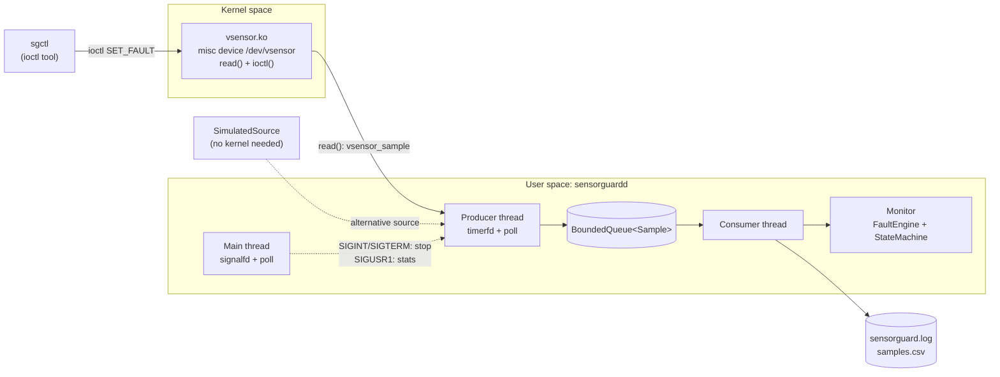
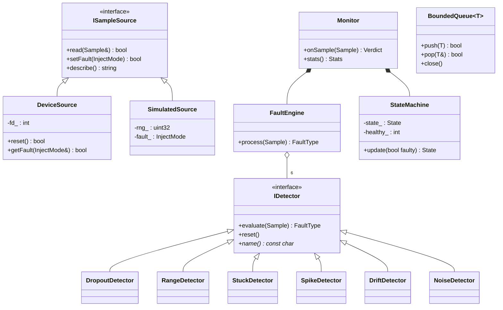
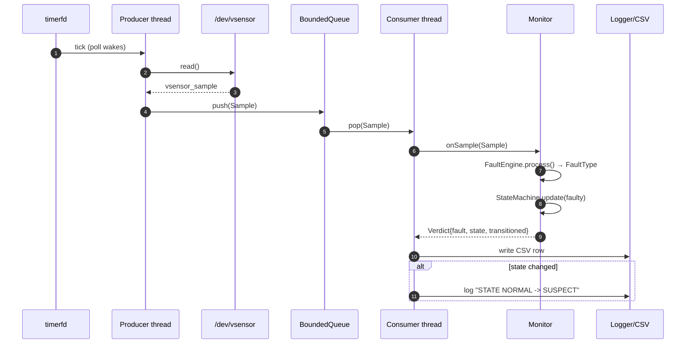
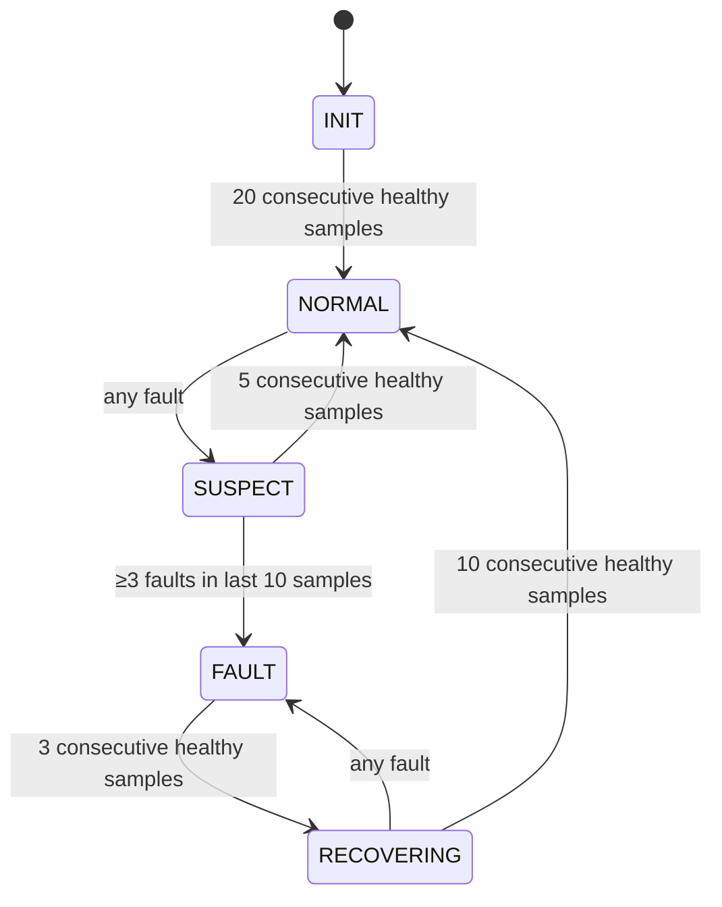

# Stage 3 – System Design, Architecture & Development Setup

## 3.1 High-level architecture



**Data flow:** timer tick → read one sample → push to queue → consumer takes it → each detector votes
→ state machine updates → transition logged / row written to CSV.

## 3.2 Components and responsibilities

| Component | Responsibility |
|---|---|
| `vsensor.c` | Generate readings, hold fault mode, serve `read`/`ioctl`, protect state with a mutex |
| `vsensor_ioctl.h` | Single shared ABI header (kernel + user) – prevents struct/enum mismatch |
| `ISampleSource` | Abstraction: `DeviceSource` (real) and `SimulatedSource` (test) |
| `IDetector` + 6 detectors | One fault type each; stateless interface, internal sliding windows |
| `FaultEngine` | Runs detectors in priority order; first fault wins |
| `StateMachine` | Turns noisy per-sample verdicts into stable health states |
| `Monitor` | Combines engine + state machine + statistics (mutex-protected snapshot) |
| `BoundedQueue<T>` | Thread-safe hand-off, back-pressure, clean shutdown via `close()` |
| `Logger` | Thread-safe timestamped logging to stderr + file |
| `main.cpp` | CLI parsing, thread orchestration, signals |

## 3.3 Data structures

```c
struct vsensor_sample {          /* kernel -> user ABI, 24 bytes */
    __u64 timestamp_ns;          /* ktime_get_ns()                */
    __s32 value_mC;              /* milli-°C (kernel: no floats)  */
    __u32 seq;                   /* monotonically increasing      */
    __u32 flags;                 /* bit0 = VALID                  */
    __u32 reserved;
};
```
```cpp
struct Sample { uint64_t timestamp_ns; double value_c; uint32_t seq; bool valid; };
enum class FaultType { None, Dropout, OutOfRange, StuckAt, Spike, Drift, Noise };
enum class State     { Init, Normal, Suspect, Fault, Recovering };
```
Sliding windows use `std::deque<double>`; queue uses `std::deque<T>` + `std::mutex` + 2 condition variables.

## 3.4 Detection algorithms

| Detector | Algorithm | Default |
|---|---|---|
| Dropout | `valid == false` | – |
| Range | `v < min || v > max` | –40 … 85 °C |
| Stuck-at | run-length of identical values ≥ N | N = 8 |
| Spike | `|v − median(last 5 accepted)| > T`; spikes are **not** added to the window | T = 5 °C |
| Drift | baseline = mean of first 20 samples; flag if `|mean(last 10) − baseline| > T` | T = 3 °C |
| Noise | population std-dev of last 10 samples > T | T = 1 °C |

*Design decision:* detectors run in **priority order and short-circuit**, so a spike cannot also inflate
the noise detector's window.

## 3.5 UML diagrams

### Class diagram


### Sequence diagram – one sample, and a fault being confirmed


### State machine diagram

(A fault during INIT restarts the warm-up counter.)

## 3.6 Implementation plan

1. Shared ABI header + driver skeleton (`insmod`, `/dev/vsensor`, `read`).
2. `ioctl` + fault generation in driver; `SimulatedSource` mirror.
3. Detectors one by one, each with unit tests.
4. State machine, then `Monitor`.
5. Daemon: queue, threads, timerfd, signals, CSV/log.
6. Testing, CI, documentation, demo.

## 3.7 Development environment & tools

| Need | Tool |
|---|---|
| OS | Ubuntu 22.04/24.04 (a **VM** is recommended for kernel work) |
| Compiler / build | `g++` ≥ 9, `cmake` ≥ 3.10, `make` |
| Kernel build | `linux-headers-$(uname -r)`, `build-essential` |
| Debugging | `gdb`, `dmesg -w`, `strace`, `-fsanitize=thread,address` |
| VCS / CI | Git, GitHub Actions |

```bash
sudo apt update
sudo apt install -y build-essential cmake git linux-headers-$(uname -r)
```

## 3.8 Git repository & branching strategy

**Model:** simplified Git-Flow.

```
main      ●────────────●───────────────●────────────●  (tags: stage-N, v1.0.0) – always working
           \          / \             / \          /
develop     ●───●───●   ●────●───●───●   ●──●────●      integration branch
             \ /           \ /            \ /
feature/*     ●             ●              ●            e.g. feature/driver, feature/detectors
```

| Rule | Detail |
|---|---|
| `main` | Stable, tagged at the end of each stage |
| `develop` | Integration; CI must be green |
| `feature/<topic>` | One branch per module; merged by pull request |
| Commits | Conventional style: `feat(driver): add SET_FAULT ioctl`, `test:`, `docs:`, `fix:`, `ci:` |
| Tags | `stage-1` … `stage-6`, `v1.0.0` |

## 3.9 Documentation & progress tracking
- `docs/stageN_*.md` – one document per stage (this folder).
- `docs/PROGRESS.md` – dated progress log: done / issues / next.
- GitHub **Issues** for tasks, **Milestones** = stages, **Project board** = Todo / Doing / Done.

## 3.10 Stage 3 deliverable checklist
- [x] Architecture diagram, component list, data structures
- [x] UML: class, sequence, state machine
- [x] Implementation plan, environment setup, Git strategy
- [x] Tagged `stage-3`
- [ ] **Presentation**: show the 4 diagrams + branching model
- [ ] Roadmap → Stage 4: implement driver + core detection
